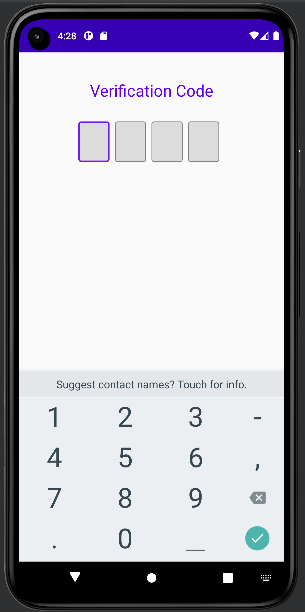
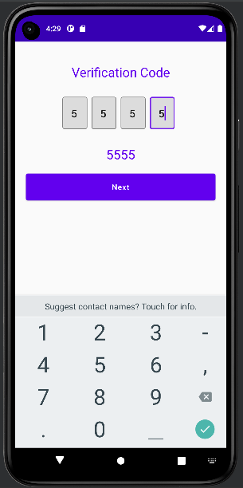

<h1 align="center">Jetpack  Compose OtpView Pin View</h1>


 &nbsp;&nbsp;
 &nbsp;&nbsp;

## How to integrate into your app?
Integrating the project is simple. All you need to do is follow the below steps

Step 1. Add the JitPack repository to your build file. Add it in your root build.gradle at the end of repositories:

```java
allprojects {
		repositories {
			maven { url 'https://jitpack.io' }
		}
	}
```
Step 2. Add the dependency
```java
dependencies {
	 implementation 'com.github.behruzbahromzoda97:OtpView:1.0'
}
```

## How to use the library?
Okay seems like you integrated the library in your project but **how do you use it**? Well its really easy.
- Using Compose
Just use the `OtpView` composable where you need to display the view like.
```kotlin
....
SmsCodeView(
            smsCodeLength = 4,
            textFieldColors = TextFieldDefaults.textFieldColors(),
            textStyle = MaterialTheme.typography.h6,
            smsFulled = {
            }
           )
....
```
- Using Older View System (aka XML)
Add a compose view in your xml file like
```xml
.....
<androidx.compose.ui.platform.ComposeView
    android:id="@+id/otp_view"
    android:layout_width="match_parent"
    android:layout_height="match_parent" />
.....
```
Next in your code assign `otp_view` with the `OtpView` composable likewise.
```kotlin
....
val otpView = findViewById(R.id.otp_view)
otpView.composeView.apply {
    // Dispose of the Composition when the view's LifecycleOwner is destroyed
    setViewCompositionStrategy(DisposeOnViewTreeLifecycleDestroyed)
    setContent {
       // In Compose world
       MaterialTheme {
          var isNextBtnStatus by remember {
                    mutableStateOf(false)
                }
                var smsCodeNumber by remember {
                    mutableStateOf("")
                }
                // A surface container using the 'background' color from the theme
                Column(modifier = Modifier.fillMaxSize()) {
                    Text(
                        modifier = Modifier
                            .fillMaxWidth()
                            .padding(start = 16.dp, end = 16.dp, top = 40.dp),
                        text = "Otp was send",
                        textAlign = TextAlign.Center,
                        style = MaterialTheme.typography.h5,
                        color = MaterialTheme.colors.primary
                    )
                    Box(
                        modifier = Modifier
                            .fillMaxWidth()
                            .padding(30.dp)
                    ) {
                        SmsCodeView(
                            smsCodeLength = 4,
                            textFieldColors = TextFieldDefaults.textFieldColors(),
                            textStyle = MaterialTheme.typography.h6,
                            smsFulled = {
                                smsCodeNumber = it
                                isNextBtnStatus = it.length == 4
                            }
                        )
                    }

                    Text(
                        text = smsCodeNumber,
                        color = MaterialTheme.colors.primary,
                        modifier = Modifier.fillMaxWidth(),
                        style = MaterialTheme.typography.h5,
                        textAlign = TextAlign.Center
                    )

                    if (isNextBtnStatus) {
                        Box(
                            modifier = Modifier
                                .fillMaxSize()
                                .padding(20.dp)
                        ) {
                            Button(onClick = { /*TODO*/ }, modifier = Modifier.fillMaxWidth().height(50.dp)) {
                                Text(text = "Next", style = MaterialTheme.typography.button)
                            }
                        }
                    }
                }
       }
    }
}
....
```

## Author
Created by [Behruz Bahromzoda](https://github.com/behruzbahromzoda97)

* Bug reports and pull requests are welcome.


